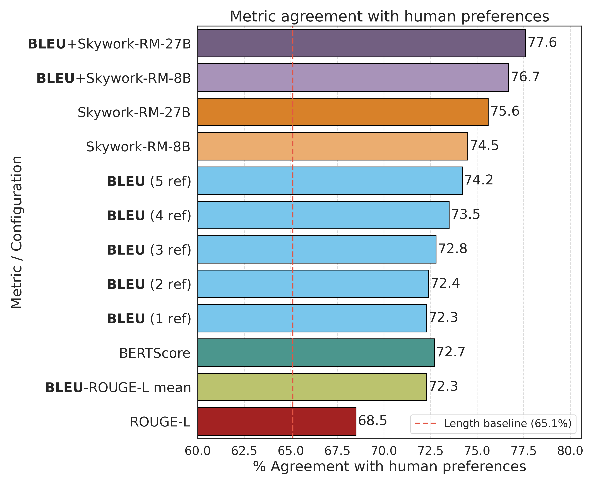
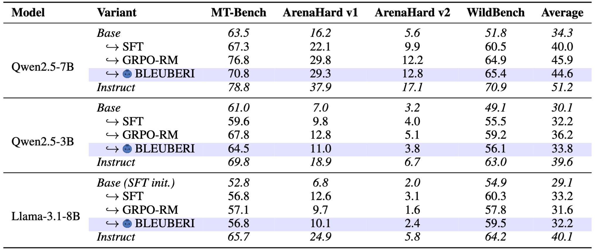
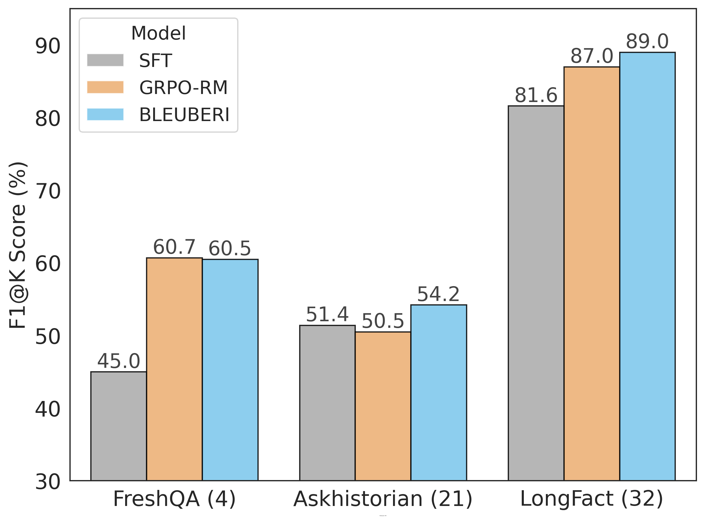

#  [BLEUBERI: BLEU is a surprisingly effective reward for instruction following](https://arxiv.org/pdf/2505.11080)

[[Paper](https://arxiv.org/pdf/2505.11080)] [[HF Collection](https://huggingface.co/collections/yapeichang/bleuberi-6840b3b9d02ff86c5878dafa)] [[Code](https://github.com/lilakk/BLEUBERI)]

This repository hosts the official code and data release for our preprint, [BLEUBERI: BLEU is a surprisingly effective reward for instruction following](https://arxiv.org/abs/2505.11080).

Authors: [Yapei Chang](https://lilakk.github.io/), [Yekyung Kim](https://mungg.github.io/), [Michael Krumdick](https://scholar.google.com/citations?user=nqf6-MwAAAAJ&hl=en), [Amir Zadeh](https://scholar.google.com/citations?user=MQFngiMAAAAJ&hl=en), [Chuan Li](https://scholar.google.com/citations?user=hoZesOwAAAAJ&hl=en), [Chris Tanner](https://www.chriswtanner.com/), [Mohit Iyyer](https://www.cs.umd.edu/~miyyer/)

> **TLDR** > We extend RLVR beyond easily verifiable domains like math and code to the more open-ended setting of general instruction following. Surprisingly, we find that BLEU—a simple n-gram matching metric—when paired with high-quality references from strong LLMs, achieves human agreement comparable to 8B and 27B reward models on Chatbot Arena outputs. Based on this insight, we introduce BLEUBERI, which uses BLEU directly as a reward in GRPO training. BLEUBERI matches the performance of RM-guided GRPO across four instruction-following benchmarks and produces more factually grounded outputs, with human raters rating them on par with those from reward model-trained systems.

If you find our work useful, please cite:
```
@misc{chang2025bleuberibleusurprisinglyeffective,
      title={BLEUBERI: BLEU is a surprisingly effective reward for instruction following}, 
      author={Yapei Chang and Yekyung Kim and Michael Krumdick and Amir Zadeh and Chuan Li and Chris Tanner and Mohit Iyyer},
      year={2025},
      eprint={2505.11080},
      archivePrefix={arXiv},
      primaryClass={cs.CL},
      url={https://arxiv.org/abs/2505.11080}, 
}
```

## BLEU's surprisingly high agreement with human preferences

> The [ChatBot Arena conversations dataset](https://huggingface.co/datasets/lmsys/chatbot_arena_conversations) contains examples with an *instruction*, *Model A response*, *Model B response*, and a *human preference label*. In our analysis of 900 samples, we find that BLEU—when using responses from strong LLMs as references—achieves surprisingly strong alignment with human preferences. Its agreement rates are comparable to those of top-performing reward models like [Skywork-RM-27B](https://huggingface.co/Skywork/Skywork-Reward-Gemma-2-27B-v0.2) and [Skywork-RM-8B](https://huggingface.co/Skywork/Skywork-Reward-Llama-3.1-8B-v0.2), which currently rank 8th and 15th on the newly updated [Reward Bench v2](https://huggingface.co/spaces/allenai/reward-bench) (as of June 2025).



Check [`arena_analysis`](./arena_analysis) for how to replicate our results. We also release the synthetic references we collected in [`arena_analysis/ref_outputs`](arena_analysis/ref_outputs).

## BLEUBERI: GRPO training with BLEU as the reward

> Building on insights from our previous analysis, we explore training models directly using BLEU as the reward, and find that the trained models are surprisingly competitive with models trained with RMs across four general instruction-following benchmarks.



Check [training](training) for details on creating training data and running GRPO / SFT training. To replicate benchmark evaluation results, see [eval](eval).

### Dataset and model releases

For our 50K data pool obtained from the [Tulu3 SFT mixture](https://huggingface.co/datasets/allenai/tulu-3-sft-mixture), we collected synthetic responses from the following LLMs: `claude-3-7-sonnet@20250219`, `deepseek-chat-v3`, `gemini-2.5-pro-exp-03-25`, `o4-mini-2025-04-16`, `Llama-3.1-8B-Instruct`. The resulting dataset, [BLEUBERI-Tulu3-50k](https://huggingface.co/datasets/yapeichang/BLEUBERI-Tulu3-50k), is publicly available on Hugging Face.

Trained models reported in our main experiment table (Table 1) can be found [here](https://huggingface.co/collections/yapeichang/bleuberi-6840b3b9d02ff86c5878dafa).

## BLEUBERI-trained models generate more factually grounded outputs

We evaluate the factual accuracy of Qwen2.5-7B variants using [VERISCORE](https://github.com/Yixiao-Song/VeriScore/tree/main), a metric designed for long-form factual generation. While BLEU is often seen as weak on factuality, recent work shows it can be helpful when optimized properly. Our BLEUBERI model, trained with BLEU-based RL, outperforms GRPO-RM and SFT on most datasets, suggesting BLEU optimization can still lead to more grounded outputs.



## Contact

If you have any questions, feel free to open a GitHub issue or email Yapei (yapeic@umd.edu).
